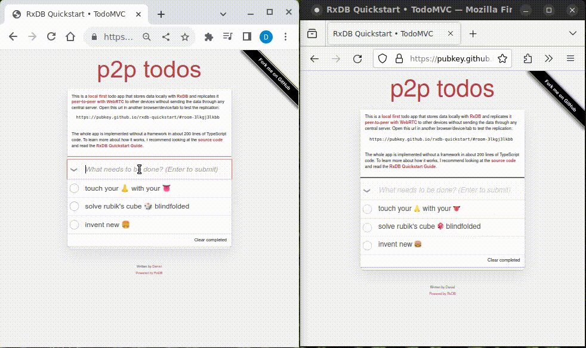

# Local-First peer-to-peer replicatted todo list with RxDB and WebRTC

This is a [local first](https://rxdb.info/offline-first.html) todo app that stores data locally with [RxDB](https://rxdb.info/) and replicates it [peer-to-peer with WebRTC](https://rxdb.info/replication-p2p.html) to other devices without sending the data throught any central server.

The whole app is implemented without a framework in about 200 lines of TypeScript code. To learn more about how it works, I recommend looking at the [source code](./src/index.ts) and read the [Quickstart Guide](https://rxdb.info/quickstart.html).

### Try live demo

The app is deployed with github pages at [https://pubkey.github.io/rxdb-quickstart/](https://pubkey.github.io/rxdb-quickstart/). It will automatically assign you a room id as url hash. Open that url in another browser/device/tab to test the replication.

### Start the app locally (requires Node.js v20 installed):

- Fork&Clone the repository.
- Run `npm install` to install the npm dependencies.
- Run `npm run dev` to start the webpack dev server and leave it open.
- Open [http://localhost:8080/](http://localhost:8080/) in your browser.
