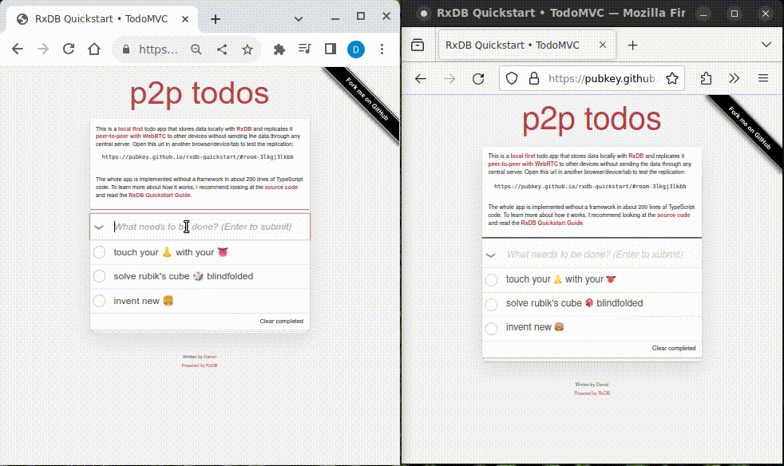

# Local-First peer-to-peer replicated todo list with RxDB and WebRTC

This is a [local first](https://rxdb.info/offline-first.html) todo app that stores data locally with [RxDB](https://rxdb.info/) and replicates it [peer-to-peer with WebRTC](https://rxdb.info/replication-webrtc.html) to other devices without sending the data throught any central server.

The whole app is implemented without a framework in about 200 lines of TypeScript code. To learn more about how it works, I recommend looking at the [source code](./src/index.ts) and read the [Quickstart Guide](https://rxdb.info/quickstart.html).

### Try live demo

The app is deployed with github pages at [https://pubkey.github.io/rxdb-quickstart/](https://pubkey.github.io/rxdb-quickstart/). It will automatically assign you a room id as url hash. Open that url in another browser/device/tab to test the replication.

### Start the app locally (requires Node.js v20 installed):

- Fork&Clone the repository.
- Run `npm install` to install the npm dependencies.
- Run `npm run dev` to start the webpack dev server and leave it open.
- Open [http://localhost:8080/](http://localhost:8080/) in your browser.
import 'package:flutter/material.dart';

void main() {
  runApp(const SovereignApp());
}

class SovereignApp extends StatelessWidget {
  const SovereignApp({super.key});

  @override
  Widget build(BuildContext context) {
    return MaterialApp(
      title: "النظام السيادي الجزائري",
      theme: ThemeData(primarySwatch: Colors.blue),
      home: const LoginPage(),
    );
  }
}

/// صفحة تسجيل الدخول السيادي
class LoginPage extends StatelessWidget {
  const LoginPage({super.key});

  @override
  Widget build(BuildContext context) {
    final TextEditingController idController = TextEditingController();
    final TextEditingController pinController = TextEditingController();

    return Scaffold(
      appBar: AppBar(title: const Text("الهوية الرقمية السيادية")),
      body: Padding(
        padding: const EdgeInsets.all(20),
        child: Column(
          children: [
            TextField(
              controller: idController,
              decoration: const InputDecoration(
                labelText: "الرقم التعريفي الحكومي",
              ),
            ),
            TextField(
              controller: pinController,
              obscureText: true,
              decoration: const InputDecoration(
                labelText: "الرقم السري (PIN)",
              ),
            ),
            const SizedBox(height: 20),
            ElevatedButton(
              onPressed: () {
                AuditLog.addEntry(
                  actor: idController.text,
                  action: "تسجيل الدخول",
                  reason: "الوصول إلى النظام السيادي",
                  device: "هاتف معتمد",
                );
                Navigator.push(
                  context,
                  MaterialPageRoute(builder: (_) => const DashboardPage()),
                );
              },
              child: const Text("تسجيل الدخول"),
            ),
          ],
        ),
      ),
    );
  }
}

/// لوحة التحكم السيادية
class DashboardPage extends StatelessWidget {
  const DashboardPage({super.key});

  @override
  Widget build(BuildContext context) {
    final List<String> ministries = [
      "رئاسة الجمهورية",
      "وزارة الداخلية",
      "وزارة الدفاع",
      "وزارة العدل",
      "وزارة المالية",
    ];

    return Scaffold(
      appBar: AppBar(title: const Text("لوحة التحكم السيادية")),
      body: ListView.builder(
        itemCount: ministries.length,
        itemBuilder: (context, index) {
          return Card(
            child: ListTile(
              title: Text(ministries[index]),
              subtitle: const Text("حيّز رقمي مستقل (Sandbox)"),
              onTap: () {
                AuditLog.addEntry(
                  actor: "مستخدم",
                  action: "فتح وزارة",
                  reason: ministries[index],
                  device: "هاتف معتمد",
                );
                Navigator.push(
                  context,
                  MaterialPageRoute(
                    builder: (_) => MinistryPage(name: ministries[index]),
                  ),
                );
              },
            ),
          );
        },
      ),
      floatingActionButton: FloatingActionButton(
        child: const Icon(Icons.history),
        onPressed: () {
          Navigator.push(
            context,
            MaterialPageRoute(builder: (_) => const AuditLogPage()),
          );
        },
      ),
    );
  }
}

/// صفحة وزارة معينة
class MinistryPage extends StatelessWidget {
  final String name;
  const MinistryPage({super.key, required this.name});

  @override
  Widget build(BuildContext context) {
    return Scaffold(
      appBar: AppBar(title: Text(name)),
      body: Center(
        child: ElevatedButton(
          onPressed: () {
            AuditLog.addEntry(
              actor: "مستخدم",
              action: "إرسال مراسلة",
              reason: "داخل $name",
              device: "هاتف معتمد",
            );
            ScaffoldMessenger.of(context).showSnackBar(
              const SnackBar(content: Text("تم إرسال المراسلة بشكل مشفر ✅")),
            );
          },
          child: const Text("إرسال مراسلة مشفرة"),
        ),
      ),
    );
  }
}

/// سجل العمليات السيادي
class AuditLog {
  static final List<Map<String, String>> _entries = [];

  static void addEntry({
    required String actor,
    required String action,
    required String reason,
    required String device,
  }) {
    _entries.add({
      "الفاعل": actor,
      "العملية": action,
      "السبب الإداري": reason,
      "الجهاز": device,
      "الزمن": DateTime.now().toString(),
    });
  }

  static List<Map<String, String>> get entries => _entries;
}

/// صفحة عرض سجل العمليات
class AuditLogPage extends StatelessWidget {
  const AuditLogPage({super.key});

  @override
  Widget build(BuildContext context) {
    final entries = AuditLog.entries;

    return Scaffold(
      appBar: AppBar(title: const Text("السجل السيادي للعمليات")),
      body: ListView.builder(
        itemCount: entries.length,
        itemBuilder: (context, index) {
          final entry = entries[index];
          return Card(
            child: ListTile(
              title: Text("${entry["العملية"]} - ${entry["الفاعل"]}"),
              subtitle: Text(
                  "السبب: ${entry["السبب الإداري"]}\nالجهاز: ${entry["الجهاز"]}\nالزمن: ${entry["الزمن"]}"),
            ),
          );
        },
      ),
    );
  }
}
ListView(
  children: algeriaStructure.entries.map((entry) {
    return ExpansionTile(
      title: Text(entry.key), // اسم الولاية
      children: (entry.value["دوائر"] as Map<String, List<String>>)
          .entries
          .map((daira) => ExpansionTile(
                title: Text(daira.key), // اسم الدائرة
                children: daira.value
                    .map((baladiya) => ListTile(title: Text(baladiya)))
                    .toList(),
              ))
          .toList(),
    );
  }).toList(),
)final Map<String, dynamic> algeriaStructure = {
  "ولاية الجزائر": {
    "دوائر": {
      "دائرة باب الواد": ["بلدية باب الواد", "بلدية القصبة"],
      "دائرة حسين داي": ["بلدية حسين داي", "بلدية القبة"],
    }
  },
  "ولاية وهران": {
    "دوائر": {
      "دائرة السانية": ["بلدية السانية", "بلدية الكرمة"],
      "دائرة عين الترك": ["بلدية عين الترك", "بلدية بئر الجير"],
    }
  },
  // ... وهكذا حتى 58 ولاية و548 دائرة و1541 بلدية
};
import 'package:flutter/material.dart';

void main() {
  runApp(const SovereignApp());
}

class SovereignApp extends StatelessWidget {
  const SovereignApp({super.key});

  @override
  Widget build(BuildContext context) {
    return MaterialApp(
      title: "النظام السيادي الجزائري",
      theme: ThemeData(primarySwatch: Colors.blue),
      home: const LoginPage(),
    );
  }
}

/// صفحة تسجيل الدخول السيادي
class LoginPage extends StatelessWidget {
  const LoginPage({super.key});

  @override
  Widget build(BuildContext context) {
    final TextEditingController idController = TextEditingController();
    final TextEditingController pinController = TextEditingController();

    return Scaffold(
      appBar: AppBar(title: const Text("الهوية الرقمية السيادية")),
      body: Padding(
        padding: const EdgeInsets.all(20),
        child: Column(
          children: [
            TextField(
              controller: idController,
              decoration: const InputDecoration(
                labelText: "الرقم التعريفي الحكومي",
              ),
            ),
            TextField(
              controller: pinController,
              obscureText: true,
              decoration: const InputDecoration(
                labelText: "الرقم السري (PIN)",
              ),
            ),
            const SizedBox(height: 20),
            ElevatedButton(
              onPressed: () {
                AuditLog.addEntry(
                  actor: idController.text,
                  action: "تسجيل الدخول",
                  reason: "الوصول إلى النظام السيادي",
                  device: "هاتف معتمد",
                );
                Navigator.push(
                  context,
                  MaterialPageRoute(builder: (_) => const DashboardPage()),
                );
              },
              child: const Text("تسجيل الدخول"),
            ),
          ],
        ),
      ),
    );
  }
}

/// لوحة التحكم السيادية
class DashboardPage extends StatelessWidget {
  const DashboardPage({super.key});

  @override
  Widget build(BuildContext context) {
    final List<String> options = [
      "نظام الصلاحيات",
      "المراسلات المشفرة",
      "لوحات الإحصاء السكاني",
      "الولايات والبلديات",
      "السجل السيادي للعمليات",
    ];

    return Scaffold(
      appBar: AppBar(title: const Text("لوحة التحكم السيادية")),
      body: ListView.builder(
        itemCount: options.length,
        itemBuilder: (context, index) {
          return Card(
            child: ListTile(
              title: Text(options[index]),
              onTap: () {
                if (options[index] == "نظام الصلاحيات") {
                  Navigator.push(
                    context,
                    MaterialPageRoute(builder: (_) => const AccessMatrixPage()),
                  );
                } else if (options[index] == "المراسلات المشفرة") {
                  Navigator.push(
                    context,
                    MaterialPageRoute(builder: (_) => const MessagingPage()),
                  );
                } else if (options[index] == "لوحات الإحصاء السكاني") {
                  Navigator.push(
                    context,
                    MaterialPageRoute(builder: (_) => const StatisticsPage()),
                  );
                } else if (options[index] == "الولايات والبلديات") {
                  Navigator.push(
                    context,
                    MaterialPageRoute(builder: (_) => const AlgeriaStructurePage()),
                  );
                } else if (options[index] == "السجل السيادي للعمليات") {
                  Navigator.push(
                    context,
                    MaterialPageRoute(builder: (_) => const AuditLogPage()),
                  );
                }
              },
            ),
          );
        },
      ),
    );
  }
}

/// صفحة نظام الصلاحيات (Access Matrix)
class AccessMatrixPage extends StatelessWidget {
  const AccessMatrixPage({super.key});

  @override
  Widget build(BuildContext context) {
    final List<Map<String, String>> accessMatrix = [
      {
        "المستوى": "موظف بلدية",
        "الصلاحيات": "تسجيل / إدارة بيانات بلديته فقط",
        "Sandbox": "بلدية مستقلة"
      },
      {
        "المستوى": "رئيس بلدية",
        "الصلاحيات": "اعتماد ملفات + إرسال تقارير للدائرة",
        "Sandbox": "بلدية + دائرة"
      },
      {
        "المستوى": "رئيس دائرة",
        "الصلاحيات": "مراقبة البلديات ضمن الدائرة",
        "Sandbox": "الدائرة"
      },
      {
        "المستوى": "والي",
        "الصلاحيات": "إدارة الملفات والقرارات التنفيذية المحلية",
        "Sandbox": "الولاية"
      },
      {
        "المستوى": "وزير",
        "الصلاحيات": "إشراف كامل على الوزارة",
        "Sandbox": "وزارة مستقلة"
      },
      {
        "المستوى": "رئيس الحكومة",
        "الصلاحيات": "تنسيق عمل الوزارات",
        "Sandbox": "جميع الوزارات (بدون الأمن إلا بتفويض)"
      },
      {
        "المستوى": "رئيس الجمهورية",
        "الصلاحيات": "صلاحية قصوى للوصول لجميع Sandboxes",
        "Sandbox": "وصول كامل ومسجّل"
      },
    ];

    return Scaffold(
      appBar: AppBar(title: const Text("نظام الصلاحيات السيادي")),
      body: ListView.builder(
        itemCount: accessMatrix.length,
        itemBuilder: (context, index) {
          final item = accessMatrix[index];
          return Card(
            child: ListTile(
              title: Text(item["المستوى"]!),
              subtitle: Text(
                  "الصلاحيات: ${item["الصلاحيات"]}\nSandbox: ${item["Sandbox"]}"),
            ),
          );
        },
      ),
    );
  }
}

/// صفحة المراسلات المشفرة
class MessagingPage extends StatelessWidget {
  const MessagingPage({super.key});

  @override
  Widget build(BuildContext context) {
    final TextEditingController messageController = TextEditingController();

    return Scaffold(
      appBar: AppBar(title: const Text("المراسلات المشفرة")),
      body: Padding(
        padding: const EdgeInsets.all(20),
        child: Column(
          children: [
            TextField(
              controller: messageController,
              decoration: const InputDecoration(
                labelText: "اكتب رسالتك هنا",
              ),
            ),
            const SizedBox(height: 20),
            ElevatedButton(
              onPressed: () {
                AuditLog.addEntry(
                  actor: "مستخدم",
                  action: "إرسال مراسلة",
                  reason: "مراسلة مشفرة",
                  device: "هاتف معتمد",
                );
                ScaffoldMessenger.of(context).showSnackBar(
                  const SnackBar(content: Text("تم إرسال الرسالة بشكل مشفر ✅")),
                );
              },
              child: const Text("إرسال"),
            ),
          ],
        ),
      ),
    );
  }
}

/// صفحة الإحصاء السكاني
class StatisticsPage extends StatelessWidget {
  const StatisticsPage({super.key});

  @override
  Widget build(BuildContext context) {
    final Map<String, dynamic> stats = {
      "عدد السكان": "45 مليون",
      "عدد الولايات": "58",
      "عدد البلديات": "1541",
      "عدد الدوائر": "548",
    };

    return Scaffold(
      appBar: AppBar(title: const Text("لوحات الإحصاء السكاني")),
      body: ListView(
        children: stats.entries.map((entry) {
          return Card(
            child: ListTile(
              title: Text(entry.key),
              subtitle: Text(entry.value.toString()),
            ),
          );
        }).toList(),
      ),
    );
  }
}

/// صفحة هيكل الولايات والبلديات (مثال مبسط)
class AlgeriaStructurePage extends StatelessWidget {
  const AlgeriaStructurePage({super.key});

  @override
  Widget build(BuildContext context) {
    final Map<String, dynamic> algeriaStructure = {
      "ولاية الجزائر": {
        "دوائر": {
          "دائرة باب الواد": ["بلدية باب الواد", "بلدية القصبة"],
          "دائرة حسين داي": ["بلدية حسين داي", "بلدية القبة"],
        }
      },
      "ولاية وهران": {
        "دوائر": {
          "دائرة السانية": ["بلدية السانية", "بلدية الكرمة"],
          "دائرة عين الترك": ["بلدية عين الترك", "بلدية بئر الجير"],
        }
      },
      // يمكن توسيع هذه القائمة لتشمل 58 ولاية و1541 بلدية كاملة
    };

    return Scaffold(
      appBar: AppBar(title: const Text("الولايات والبلديات")),
      body: ListView(
        children: algeriaStructure.entries.map((entry) {
          return ExpansionTile(
            title: Text(entry.key),
            children: (entry.value["دوائر"] as Map<String, List<String>>)
                .entries
                .map((daira) => ExpansionTile(
                      title: Text(daira.key),
                      children: daira.value
                          .map((baladiya) => ListTile(title: 

import 'package:flutter/material.dart';

void main() {
  runApp(const SovereignApp());
}

class SovereignApp extends StatelessWidget {
  const SovereignApp({super.key});

  @override
  Widget build(BuildContext context) {
    return MaterialApp(
      title: "النظام السيادي الجزائري",
      theme: ThemeData(primarySwatch: Colors.blue),
      home: const LoginPage(),
    );
  }
}

/// صفحة تسجيل الدخول السيادي
class LoginPage extends StatelessWidget {
  const LoginPage({super.key});

  @override
  Widget build(BuildContext context) {
    final TextEditingController idController = TextEditingController();
    final TextEditingController pinController = TextEditingController();

    return Scaffold(
      appBar: AppBar(title: const Text("الهوية الرقمية السيادية")),
      body: Padding(
        padding: const EdgeInsets.all(20),
        child: Column(
          children: [
            TextField(
              controller: idController,
              decoration: const InputDecoration(
                labelText: "الرقم التعريفي الحكومي",
              ),
            ),
            TextField(
              controller: pinController,
              obscureText: true,
              decoration: const InputDecoration(
                labelText: "الرقم السري (PIN)",
              ),
            ),
            const SizedBox(height: 20),
            ElevatedButton(
              onPressed: () {
                AuditLog.addEntry(
                  actor: idController.text,
                  action: "تسجيل الدخول",
                  reason: "الوصول إلى النظام السيادي",
                  device: "هاتف معتمد",
                );
                Navigator.push(
                  context,
                  MaterialPageRoute(builder: (_) => const DashboardPage()),
                );
              },
              child: const Text("تسجيل الدخول"),
            ),
          ],
        ),
      ),
    );
  }
}

/// لوحة التحكم السيادية
class DashboardPage extends StatelessWidget {
  const DashboardPage({super.key});

  @override
  Widget build(BuildContext context) {
    final List<String> options = [
      "نظام الصلاحيات",
      "المراسلات المشفرة",
      "لوحات الإحصاء السكاني",
      "الولايات والبلديات",
      "السجل السيادي للعمليات",
    ];

    return Scaffold(
      appBar: AppBar(title: const Text("لوحة التحكم السيادية")),
      body: ListView.builder(
        itemCount: options.length,
        itemBuilder: (context, index) {
          return Card(
            child: ListTile(
              title: Text(options[index]),
              onTap: () {
                if (options[index] == "نظام الصلاحيات") {
                  Navigator.push(
                    context,
                    MaterialPageRoute(builder: (_) => const AccessMatrixPage()),
                  );
                } else if (options[index] == "المراسلات المشفرة") {
                  Navigator.push(
                    context,
                    MaterialPageRoute(builder: (_) => const MessagingPage()),
                  );
                } else if (options[index] == "لوحات الإحصاء السكاني") {
                  Navigator.push(
                    context,
                    MaterialPageRoute(builder: (_) => const StatisticsPage()),
                  );
                } else if (options[index] == "الولايات والبلديات") {
                  Navigator.push(
                    context,
                    MaterialPageRoute(builder: (_) => const AlgeriaStructurePage()),
                  );
                } else if (options[index] == "السجل السيادي للعمليات") {
                  Navigator.push(
                    context,
                    MaterialPageRoute(builder: (_) => const AuditLogPage()),
                  );
                }
              },
            ),
          );
        },
      ),
    );
  }
}

/// صفحة نظام الصلاحيات
class AccessMatrixPage extends StatelessWidget {
  const AccessMatrixPage({super.key});

  @override
  Widget build(BuildContext context) {
    final List<Map<String, String>> accessMatrix = [
      {"المستوى": "موظف بلدية", "الصلاحيات": "تسجيل / إدارة بيانات بلديته فقط"},
      {"المستوى": "رئيس بلدية", "الصلاحيات": "اعتماد ملفات + إرسال تقارير للدائرة"},
      {"المستوى": "رئيس دائرة", "الصلاحيات": "مراقبة البلديات ضمن الدائرة"},
      {"المستوى": "والي", "الصلاحيات": "إدارة الملفات والقرارات التنفيذية المحلية"},
      {"المستوى": "وزير", "الصلاحيات": "إشراف كامل على الوزارة"},
      {"المستوى": "رئيس الحكومة", "الصلاحيات": "تنسيق عمل الوزارات"},
      {"المستوى": "رئيس الجمهورية", "الصلاحيات": "صلاحية قصوى للوصول لجميع Sandboxes"},
    ];

    return Scaffold(
      appBar: AppBar(title: const Text("نظام الصلاحيات السيادي")),
      body: ListView.builder(
        itemCount: accessMatrix.length,
        itemBuilder: (context, index) {
          final item = accessMatrix[index];
          return Card(
            child: ListTile(
                    child: ListTile(
              title: Text(item["المستوى"]!),
              subtitle: Text("الصلاحيات: ${item["الصلاحيات"]}"),
            ),
          );
        },
      ),
    );
  }
}

/// صفحة المراسلات المشفرة
class MessagingPage extends StatelessWidget {
  const MessagingPage({super.key});

  @override
  Widget build(BuildContext context) {
    final TextEditingController messageController = TextEditingController();

    return Scaffold(
      appBar: AppBar(title: const Text("المراسلات المشفرة")),
      body: Padding(
        padding: const EdgeInsets.all(20),
        child: Column(
          children: [
            TextField(
              controller: messageController,
              decoration: const InputDecoration(
                labelText: "اكتب رسالتك هنا",
              ),
            ),
            const SizedBox(height: 20),
            ElevatedButton(
              onPressed: () {
                AuditLog.addEntry(
                  actor: "مستخدم",
                  action: "إرسال مراسلة",
                  reason: "مراسلة مشفرة",
                  device: "هاتف معتمد",
                );
                ScaffoldMessenger.of(context).showSnackBar(
                  const SnackBar(content: Text("تم إرسال الرسالة بشكل مشفر ✅")),
                );
              },
              child: const Text("إرسال"),
            ),
          ],
        ),
      ),
    );
  }
}

/// صفحة الإحصاء السكاني
class StatisticsPage extends StatelessWidget {
  const StatisticsPage({super.key});

  @override
  Widget build(BuildContext context) {
    final Map<String, dynamic> stats = {
      "عدد السكان": "45 مليون",
      "عدد الولايات": "58",
      "عدد البلديات": "1541",
      "عدد الدوائر": "548",
    };

    return Scaffold(
      appBar: AppBar(title: const Text("لوحات الإحصاء السكاني")),
      body: ListView(
        children: stats.entries.map((entry) {
          return Card(
            child: ListTile(
              title: Text(entry.key),
              subtitle: Text(entry.value.toString()),
            ),
          );
        }).toList(),
      ),
    );
  }
}

/// صفحة هيكل الولايات والبلديات (Sub-Sandbox)
class AlgeriaStructurePage extends StatelessWidget {
  const AlgeriaStructurePage({super.key});

  @override
  Widget build(BuildContext context) {
    // مثال مبسط: يمكن توسيع هذه القائمة لتشمل كل الولايات والبلديات من الملف الذي أرسلته
    final Map<String, dynamic> algeriaStructure = {
      "ولاية أدرار": {
        "بلديات": [
          "أدرار",
          "تامست",
          "فنوغيل",
          "إن زغمير",
          "ريغان",
          "سالي",
          "أولاد أحمد تيمي",
          "تيطاف",
          "تمنطيط",
          "بودة",
          "أوقروت",
          "دلدول",
          "المطارفة",
          "تسببت",
          "زاوية كنتة",
          "أكابلي"
        ]
      },
      "ولاية الجزائر": {
        "بلديات": [
          "الجزائر الوسطى",
          "سيدي امحمد",
          "المدنية",
          "بلوزداد",
          "باب الوادي",
          "بولوغين",
          "القصبة",
          "بئر مراد رايس",
          "بئر خادم",
          "حيدرة",
          "سحاولة",
          "جسر قسنطينة",
          "الشراقة",
          "دالي ابراهيم",
          "أولاد فايت",
          "زرالدة",
          "سطاوالي",
          "عين طاية",
          "هراوة",
          "المرسى",
          "برج الكيفان",
          "باب الزوار",
          "المحمدية",
          "الدار البيضاء",
          "الكاليتوس",
          "براقي",
          "سيدي موسى",
          "الحراش",
          "القبة",
          "حسين داText(baladiya)))

import 'dart:convert';
import 'package:flutter/services.dart' show rootBundle;

class AlgeriaStructurePage extends StatefulWidget {
  const AlgeriaStructurePage({super.key});

  @override
  State<AlgeriaStructurePage> createState() => _AlgeriaStructurePageState();
}

class _AlgeriaStructurePageState extends State<AlgeriaStructurePage> {
  Map<String, dynamic> algeriaData = {};

  @override
  void initState() {
    super.initState();
    loadData();
  }

  Future<void> loadData() async {
    final String response = await rootBundle.loadString('assets/algeria.json');
    final data = json.decode(response);
    setState(() {
      algeriaData = data;
    });
  }

  @override
  Widget build(BuildContext context) {
    return Scaffold(
      appBar: AppBar(title: const Text("الولايات والبلديات")),
      body: ListView(
        children: algeriaData.entries.map((entry) {
          return ExpansionTile(
            title: Text(entry.key),
            children: (entry.value["بلديات"] as List<dynamic>)
                .map((baladiya) => ListTile(
                      title: Text(baladiya),
                      onTap: () {
                        AuditLog.addEntry(
                          actor: "مستخدم",
                          action: "فتح بلدية",
                          reason: baladiya,
                          device: "هاتف معتمد",
                        );
                        ScaffoldMessenger.of(context).showSnackBar(
                          SnackBar(content: Text("عرض بيانات $baladiya")),
                        );
                      },
                    ))
                .toList(),
          );
        }).toList(),
      ),
    );
  }
}
import 'dart:convert';
import 'package:flutter/services.dart' show rootBundle;

Future<Map<String, dynamic>> loadAlgeriaData() async {
  final String response = await rootBundle.loadString('assets/algeria.json');
  return json.decode(response);
}
class AlgeriaStructurePage extends StatefulWidget {
  const AlgeriaStructurePage({super.key});

  @override
  State<AlgeriaStructurePage> createState() => _AlgeriaStructurePageState();
}

class _AlgeriaStructurePageState extends State<AlgeriaStructurePage> {
  Map<String, dynamic> algeriaData = {};

  @override
  void initState() {
    super.initState();
    loadData();
  }

  Future<void> loadData() async {
    final data = await loadAlgeriaData();
    setState(() {
      algeriaData = data;
    });
  }

  @override
  Widget build(BuildContext context) {
    return Scaffold(
      appBar: AppBar(title: const Text("الولايات والبلديات")),
      body: ListView(
        children: algeriaData.entries.map((entry) {
          return ExpansionTile(
            title: Text(entry.key),
            children: (entry.value["بلديات"] as List<dynamic>)
                .map((baladiya) => ListTile(
                      title: Text(baladiya),
                      onTap: () {
                        AuditLog.addEntry(
                          actor: "مستخدم",
                          action: "فتح بلدية",
                          reason: baladiya,
                          device: "هاتف معتمد",
                        );
                        ScaffoldMessenger.of(context).showSnackBar(
                          SnackBar(content: Text("عرض بيانات $baladiya")),
                        );
                      },
                    ))
                .toList(),
          );
        }).toList(),
      ),
    );
  }
}
flutter:
  assets:
    - assets/algeria.jsonflutter:
  assets:
 
   - assets/algeria.json
{
  import 'package:flutter_local_notifications/flutter_local_notifications.dart';

final FlutterLocalNotificationsPlugin notificationsPlugin =
    FlutterLocalNotificationsPlugin();

Future<void> showNotification(String title, String body, String importance) async {
  String sound = 'normal.wav';
  if (importance == 'medium') sound = 'alert.wav';
  if (importance == 'high') sound = 'alarm.wav';

  var androidDetails = AndroidNotificationDetails(
    'channel_id',
    'channel_name',
    importance: Importance.max,
    priority: Priority.high,
    sound: RawResourceAndroidNotificationSound(sound.split('.')[0]),
  );

  var platformDetails = NotificationDetails(android: androidDetails);

  await notificationsPlugin.show(
    0,
    title,
    body,
    platformDetails,
  );
}
{
  "message_id": "MSG-2026-001",
  "from": {
    "role": "رئيس بلدية الشهبونية",
    "email": "mayor.chahbounia@algeria.gov"
  },
  "to": {
    "role": "والي ولاية المدية",
    "email": "wali.medea@algeria.gov"
  },
  "subject": "طلب دعم في مشروع صحي",
  "content": "تم تسجيل عدة شكاوى حول نقص التجهيزات الطبية في بلدية الشهبونية. نرجو التدخل العاجل.",
  "priority": "high",
  "digital_signature": "SHA256-Encrypted-Hash"
}
ExpansionTile(
  title: Text("ولاية المدية"),
  children: [
    ListTile(
      title: Text("عدد السكان: 900000"),
    ),
    ListTile(
      title: Text("المشاريع التنموية: مشروع زراعي واسع، تطوير الطرق السريعة"),
    ),
    ExpansionTile(
      title: Text("بلديات"),
      children: [
        ListTile(title: Text("المدية")),
        ListTile(title: Text("البرواقية")),
        ListTile(title: Text("الشهبونية")),
        // بقية البلديات...
      ],
    ),
  ],
)
-- جدول الولايات
CREATE TABLE Wilayas (
    wilaya_id SERIAL PRIMARY KEY,
    name VARCHAR(100) NOT NULL,
    population INT,
    projects TEXT,
    black_points TEXT
);

-- جدول البلديات
CREATE TABLE Municipalities (
    municipality_id SERIAL PRIMARY KEY,
    name VARCHAR(100) NOT NULL,
    wilaya_id INT REFERENCES Wilayas(wilaya_id) ON DELETE CASCADE,
    population INT,
    projects TEXT,
    complaints TEXT
);

-- جدول المستخدمين
CREATE TABLE Users (
    user_id SERIAL PRIMARY KEY,
    name VARCHAR(100),
    email VARCHAR(150) UNIQUE NOT NULL,
    password_hash VARCHAR(255) NOT NULL,
    role VARCHAR(50),
    permissions TEXT
);

-- جدول الشكاوى
CREATE TABLE Complaints (
    complaint_id SERIAL PRIMARY KEY,
    title VARCHAR(200),
    description TEXT,
    priority VARCHAR(20), -- عادي، متوسط، خطير
    status VARCHAR(20),   -- مفتوحة، قيد المعالجة، مرفوعة، مغلقة
    submitted_by INT REFERENCES Users(user_id),
    municipality_id INT REFERENCES Municipalities(municipality_id),
    assigned_to INT REFERENCES Users(user_id),
    created_at TIMESTAMP DEFAULT CURRENT_TIMESTAMP,
    updated_at TIMESTAMP DEFAULT CURRENT_TIMESTAMP
);

-- جدول المراسلات المشفرة
CREATE TABLE Messages (
    message_id SERIAL PRIMARY KEY,
    from_user INT REFERENCES Users(user_id),
    to_user INT REFERENCES Users(user_id),
    subject VARCHAR(200),
    content_encrypted TEXT,
    priority VARCHAR(20),
    digital_signature VARCHAR(255),
    created_at TIMESTAMP DEFAULT CURRENT_TIMESTAMP
);

-- جدول الإشعارات
CREATE TABLE Notifications (
    notification_id SERIAL PRIMARY KEY,
    user_id INT REFERENCES Users(user_id),
    title VARCHAR(200),
    body TEXT,
    importance VARCHAR(20), -- عادي، متوسط، خطير
    sound_file VARCHAR(100),
    created_at TIMESTAMP DEFAULT CURRENT_TIMESTAMP
);
class ComplaintAI {
  Map<String, int> wordFrequency = {};
  Map<String, int> categoryCount = {};

  // تعلم من شكوى جديدة
  void learn(String text, String category) {
    categoryCount[category] = (categoryCount[category] ?? 0) + 1;
    for (var word in text.split(' ')) {
      String key = "$category:$word";
      wordFrequency[key] = (wordFrequency[key] ?? 0) + 1;
    }
  }

  // تصنيف شكوى جديدة
  String classify(String text) {
    String bestCategory = "";
    double bestScore = -1;

    for (var category in categoryCount.keys) {
      double score = 0;
      for (var word in text.split(' ')) {
        String key = "$category:$word";
        score += (wordFrequency[key] ?? 0).toDouble();
      }
      if (score > bestScore) {
        bestScore = score;
        bestCategory = category;
      }
    }
    return bestCategory.isEmpty ? "غير محدد" : bestCategory;
  }

  // ملخص بسيط للشكوى
  String summarize(String text) {
    List<String> words = text.split(' ');
    if (words.length <= 10) return text;
    return words.take(10).join(' ') + "...";
  }
}PieChart(
  PieChartData(
    sections: [
      PieChartSectionData(value: 40, title: "خدمات عامة"),
      PieChartSectionData(value: 30, title: "إدارية"),
      PieChartSectionData(value: 30, title: "أمنية"),
    ],
  ),
)void main() {
  ComplaintAI ai = ComplaintAI();

  // تدريب النموذج
  ai.learn("انقطاع الكهرباء في البلدية", "خدمات عامة");
  ai.learn("تأخر في استخراج الوثائق", "إدارية");
  ai.learn("تهديد أمني في السوق", "أمنية");

  // تصنيف شكوى جديدة
  String category = ai.classify("المواطنون يشتكون من انقطاع الكهرباء");
  print("التصنيف: $category");

  // ملخص
  String summary = ai.summarize("تم تسجيل عدة شكاوى حول نقص التجهيزات الطبية في بلدية الشهبونية ونرجو التدخل العاجل");
  print("الملخص: $summary");
}
class Complaint {
  String id;
  String text;
  String category;
  String status; // مفتوحة، قيد المعالجة، مرفوعة، مغلقة
  DateTime createdAt;
  String assignedTo; // الجهة الحالية

  Complaint({
    required this.id,
    required this.text,
    required this.category,
    this.status = "مفتوحة",
    required this.createdAt,
    required this.assignedTo,
  });
}

class ComplaintAI {
  List<Complaint> complaints = [];

  // إضافة شكوى جديدة
  void addComplaint(String text, String category, String assignedTo) {
    complaints.add(Complaint(
      id: DateTime.now().millisecondsSinceEpoch.toString(),
      text: text,
      category: category,
      createdAt: DateTime.now(),
      assignedTo: assignedTo,
    ));
  }

  // متابعة الشكاوى ورفعها تلقائيًا
  void autoEscalate(Duration maxDuration) {
    for (var complaint in complaints) {
      if ((complaint.status == "مفتوحة" || complaint.status == "قيد المعالجة") &&
          DateTime.now().difference(complaint.createdAt) > maxDuration) {
        complaint.status = "مرفوعة";
        complaint.assignedTo = escalateToHigherAuthority(complaint.assignedTo);
        print("تم رفع الشكوى ${complaint.id} إلى ${complaint.assignedTo}");
      }
    }
  }

  // تحديد الجهة الأعلى
  String escalateToHigherAuthority(String current) {
    switch (current) {
      case "رئيس بلدية":
        return "رئيس دائرة";
      case "رئيس دائرة":
        return "والي";
      case "والي":
        return "رئيس الجمهورية";
      default:
        return "رئيس الجمهورية";
    }
  }

  // ملخص سريع للشكاوى
  String summary() {
    int open = complaints.where((c) => c.status == "مفتوحة").length;
    int escalated = complaints.where((c) => c.status == "مرفوعة").length;
    int closed = complaints.where((c) => c.status == "مغلقة").length;
    return "مفتوحة: $open | مرفوعة: $escalated | مغلقة: $closed";
  }
}void main() {
  ComplaintAI ai = ComplaintAI();

  // إضافة شكاوى
  ai.addComplaint("انقطاع الكهرباء في البلدية", "خدمات عامة", "رئيس بلدية");
  ai.addComplaint("تهديد أمني في السوق", "أمنية", "رئيس دائرة");

  // محاكاة مرور الوقت (بعد 48 ساعة)
  ai.autoEscalate(Duration(hours: 48));

  // عرض ملخص
  print(ai.summary());
}
dependencies:
  fl_chart: ^0.65.0
import 'package:flutter/material.dart';
import 'package:fl_chart/fl_chart.dart';

// نفترض أن لديك ComplaintAI من الكود السابق
class DashboardScreen extends StatelessWidget {
  final ComplaintAI ai;

  DashboardScreen({required this.ai});

  @override
  Widget build(BuildContext context) {
    int open = ai.complaints.where((c) => c.status == "مفتوحة").length;
    int escalated = ai.complaints.where((c) => c.status == "مرفوعة").length;
    int closed = ai.complaints.where((c) => c.status == "مغلقة").length;

    return Scaffold(
      appBar: AppBar(title: Text("لوحة متابعة الشكاوى")),
      body: Padding(
        padding: const EdgeInsets.all(20.0),
        child: Column(
          children: [
            Text(
              ai.summary(),
              style: TextStyle(fontSize: 18, fontWeight: FontWeight.bold),
            ),
            SizedBox(height: 20),
            Expanded(
              child: PieChart(
                PieChartData(
                  sections: [
                    PieChartSectionData(
                      value: open.toDouble(),
                      title: "مفتوحة",
                      color: Colors.blue,
                    ),
                    PieChartSectionData(
                      value: escalated.toDouble(),
                      title: "مرفوعة",
                      color: Colors.orange,
                    ),
                    PieChartSectionData(
                      value: closed.toDouble(),
                      title: "مغلقة",
                      color: Colors.green,
                    ),
                  ],
                ),
              ),
            ),
            SizedBox(height: 20),
            Expanded(
              child: ListView.builder(
                itemCount: ai.complaints.length,
                itemBuilder: (context, index) {
                  var c = ai.complaints[index];
                  return Card(
                    child: ListTile(
                      title: Text(c.text),
                      subtitle: Text(
                          "الحالة: ${c.status} | الجهة الحالية: ${c.assignedTo}"),
                    ),
                  );
                },
              ),
            ),
          ],
        ),
      ),
    );
  }
}
dependencies:
  flutter_local_notifications: ^17.0.0import 'package:flutter_local_notifications/flutter_local_notifications.dart';

final FlutterLocalNotificationsPlugin notificationsPlugin =
    FlutterLocalNotificationsPlugin();

Future<void> initNotifications() async {
  const AndroidInitializationSettings androidSettings =
      AndroidInitializationSettings('@mipmap/ic_launcher');

  const InitializationSettings settings =
      InitializationSettings(android: androidSettings);

  await notificationsPlugin.initialize(settings);
}notificationsPlugin.showFuture<void> showComplaintNotification(String title, String body, String priority) async {
  String sound = 'normal'; // ملف صوتي في res/raw أو assets
  if (priority == 'medium') sound = 'alert';
  if (priority == 'high') sound = 'alarm';

  const AndroidNotificationDetails androidDetails = AndroidNotificationDetails(
    'complaints_channel',
    'Complaints Notifications',
    importance: Importance.max,
    priority: Priority.high,
    playSound: true,
    sound: RawResourceAndroidNotificationSound('alarm'), // مثال: alarm.wav
  );

  NotificationDetails details = NotificationDetails(android: androidDetails);

  await notificationsPlugin.show(
    0,
    title,
    body,
    details,
  );
}void handleNewComplaint(Complaint complaint) {
  String priority = complaint.priority; // عادي، متوسط، خطير
  showComplaintNotification(
    "شكوى جديدة",
    "تم تسجيل شكوى: ${complaint.text}",
    priority,
  );
}void handleEscalation(Complaint complaint) {
  showComplaintNotification(
    "رفع شكوى",
    "تم رفع الشكوى ${complaint.id} إلى ${complaint.assignedTo}",
    "high",
  );
}
flutter:
  assets:
    - assets/sounds/normal.wav
    - assets/sounds/alert.wav
    - assets/sounds/alarm.wavassets/sounds/notificationsPlugin.show// شكوى عادية
showComplaintNotification("شكوى جديدة", "تم تسجيل شكوى بسيطة", "normal");

// شكوى متوسطة
showComplaintNotification("تنبيه", "تأخر في معالجة الوثائق", "medium");

// شكوى خطيرة
showComplaintNotification("تحذير عاجل", "تهديد أمني في السوق", "high");import 'package:flutter_local_notifications/flutter_local_notifications.dart';

final FlutterLocalNotificationsPlugin notificationsPlugin =
    FlutterLocalNotificationsPlugin();

Future<void> initNotifications() async {
  const AndroidInitializationSettings androidSettings =
      AndroidInitializationSettings('@mipmap/ic_launcher');

  const InitializationSettings settings =
      InitializationSettings(android: androidSettings);

  await notificationsPlugin.initialize(settings);
}

Future<void> showComplaintNotification(String title, String body, String priority) async {
  String soundFile = 'normal'; // الافتراضي
  if (priority == 'medium') soundFile = 'alert';
  if (priority == 'high') soundFile = 'alarm';

  var androidDetails = AndroidNotificationDetails(
    'complaints_channel',
    'Complaints Notifications',
    importance: Importance.max,
    priority: Priority.high,
    playSound: true,
    sound: RawResourceAndroidNotificationSound(soundFile),
  );

  var details = NotificationDetails(android: androidDetails);

  await notificationsPlugin.show(
    0,
    title,
    body,
    details,
  );
}
complaint.assignedTocomplaint.idcomplaint.statusvoid autoEscalate(Duration maxDuration) {
  for (var complaint in complaints) {
    if ((complaint.status == "مفتوحة" || complaint.status == "قيد المعالجة") &&
        DateTime.now().difference(complaint.createdAt) > maxDuration) {
      complaint.status = "مرفوعة";
      complaint.assignedTo = escalateToHigherAuthority(complaint.assignedTo);

      // إشعار عند التصعيد
      showComplaintNotification(
        "رفع شكوى",
        "تم رفع الشكوى ${complaint.id} إلى ${complaint.assignedTo}",
        "high", // صوت الإنذار
      );
    }
  }
}void main() async {
  ComplaintAI ai = ComplaintAI();

  // تهيئة الإشعارات
  await initNotifications();

  // إضافة شكوى جديدة
  ai.addComplaint("انقطاع الكهرباء في البلدية", "خدمات عامة", "رئيس بلدية");

  // محاكاة مرور الوقت (بعد 48 ساعة)
  ai.autoEscalate(Duration(hours: 48));

  // عرض ملخص
  print(ai.summary());
}
import 'package:flutter/material.dart';

class AlgeriaNotificationWidget extends StatelessWidget {
  final String title;
  final String body;

  const AlgeriaNotificationWidget({required this.title, required this.body});

  @override
  Widget build(BuildContext context) {
    return Container(
      decoration: BoxDecoration(
        gradient: LinearGradient(
          colors: [Colors.amber.shade700, Colors.amber.shade400],
          begin: Alignment.topLeft,
          end: Alignment.bottomRight,
        ),
        borderRadius: BorderRadius.circular(16),
        boxShadow: [
          BoxShadow(
            color: Colors.black26,
            blurRadius: 8,
            offset: Offset(2, 4),
          ),
        ],
      ),
      padding: EdgeInsets.all(16),
      child: Row(
        children: [
          // أيقونة الجزائر باللون الذهبي مع نجمة وهلال
          Stack(
            alignment: Alignment.center,
            children: [
              Icon(Icons.map, size: 60, color: Colors.amber.shade900),
              Column(
                mainAxisAlignment: MainAxisAlignment.center,
                children: [
                  Icon(Icons.star, size: 24, color: Colors.white),
                  Icon(Icons.brightness_2, size: 24, color: Colors.white70),
                ],
              ),
            ],
          ),
          SizedBox(width: 16),
          // النصوص
          Expanded(
            child: Column(
              crossAxisAlignment: CrossAxisAlignment.start,
              children: [
                Text(title,
                    style: TextStyle(
                        fontSize: 18,
                        fontWeight: FontWeight.bold,
                        color: Colors.white)),
                SizedBox(height: 8),
                Text(body,
                    style: TextStyle(
                        fontSize: 14,
                        color: Colors.white.withOpacity(0.9))),
              ],
            ),
          ),
        ],
      ),
    );
  }
}Scaffold(
  body: Center(
    child: AlgeriaNotificationWidget(
      title: "رفع شكوى",
      body: "تم رفع الشكوى رقم 2026 إلى والي ولاية المدية",
    ),
  ),
);[واجهة المستخدم Flutter]
       |
       v
[نظام الإشعارات المحلية] <---> [ذكاء اصطناعي محلي]
       |                               |
       v                               v
[قاعدة البيانات (SQLite/Hive)] <----> [لوحات رسومية (Charts)]
import 'package:flutter/material.dart';

class AlgeriaNotificationWidget extends StatelessWidget {
  final String title;
  final String body;

  const AlgeriaNotificationWidget({required this.title, required this.body});

  @override
  Widget build(BuildContext context) {
    return Container(
      decoration: BoxDecoration(
        gradient: LinearGradient(
          colors: [Colors.amber.shade900, Colors.amber.shade400],
          begin: Alignment.topLeft,
          end: Alignment.bottomRight,
        ),
        borderRadius: BorderRadius.circular(16),
        boxShadow: [
          BoxShadow(
            color: Colors.black26,
            blurRadius: 8,
            offset: Offset(2, 4),
          ),
        ],
      ),
      padding: EdgeInsets.all(16),
      child: Row(
        children: [
          // خريطة الجزائر باللون الذهبي مع نجمة وهلال
          Stack(
            alignment: Alignment.center,
            children: [
              Icon(Icons.map, size: 60, color: Colors.amber.shade700),
              Column(
                mainAxisAlignment: MainAxisAlignment.center,
                children: [
                  Icon(Icons.star, size: 24, color: Colors.white),
                  Icon(Icons.brightness_2, size: 24, color: Colors.white70),
                ],
              ),
            ],
          ),
          SizedBox(width: 16),
          // النصوص
          Expanded(
            child: Column(
              crossAxisAlignment: CrossAxisAlignment.start,
              children: [
                Text(title,
                    style: TextStyle(
                        fontSize: 18,
                        fontWeight: FontWeight.bold,
                        color: Colors.white)),
                SizedBox(height: 8),
                Text(body,
                    style: TextStyle(
                        fontSize: 14,
                        color: Colors.white.withOpacity(0.9))),
              ],
            ),
          ),
        ],
      ),
    );
  }
}Future<void> showComplaintNotification(
    String title, String body, String priority, BuildContext context) async {
  // اختيار الصوت حسب الخطورة
  String soundFile = 'normal';
  if (priority == 'medium') soundFile = 'alert';
  if (priority == 'high') soundFile = 'alarm';

  // عرض الإشعار الصوتي
  await notificationsPlugin.show(
    0,
    title,
    body,
    NotificationDetails(
      android: AndroidNotificationDetails(
        'complaints_channel',
        'Complaints Notifications',
        importance: Importance.max,
        priority: Priority.high,
        playSound: true,
        sound: RawResourceAndroidNotificationSound(soundFile),
      ),
    ),
  );

  // عرض الشكل الفخم داخل التطبيق
  showDialog(
    context: context,
    builder: (_) => Dialog(
      backgroundColor: Colors.transparent,
      child: AlgeriaNotificationWidget(title: title, body: body),
    ),
  );
}ElevatedButton(
  onPressed: () {
    showComplaintNotification(
      "رفع شكوى",
      "تم رفع الشكوى رقم 2026 إلى والي ولاية المدية",
      "high",
      context,
    );
  },
  child: Text("اختبار إشعار"),
);
import 'package:flutter/material.dart';

class AlgeriaNotificationWidget extends StatelessWidget {
  final String title;
  final String body;
  final String priority; // normal, medium, high

  const AlgeriaNotificationWidget({
    required this.title,
    required this.body,
    required this.priority,
  });

  // اختيار التدرج اللوني حسب الخطورة
  LinearGradient _getGradient() {
    switch (priority) {
      case "medium":
        return LinearGradient(
          colors: [Colors.orange.shade700, Colors.orange.shade400],
          begin: Alignment.topLeft,
          end: Alignment.bottomRight,
        );
      case "high":
        return LinearGradient(
          colors: [Colors.red.shade800, Colors.red.shade400],
          begin: Alignment.topLeft,
          end: Alignment.bottomRight,
        );
      default:
        return LinearGradient(
          colors: [Colors.green.shade700, Colors.green.shade400],
          begin: Alignment.topLeft,
          end: Alignment.bottomRight,
        );
    }
  }

  @override
  Widget build(BuildContext context) {
    return Container(
      decoration: BoxDecoration(
        gradient: _getGradient(),
        borderRadius: BorderRadius.circular(16),
        boxShadow: [
          BoxShadow(
            color: Colors.black26,
            blurRadius: 8,
            offset: Offset(2, 4),
          ),
        ],
      ),
      padding: EdgeInsets.all(16),
      child: Row(
        children: [
          // خريطة الجزائر باللون الذهبي مع نجمة وهلال
          Stack(
            alignment: Alignment.center,
            children: [
              Icon(Icons.map, size: 60, color: Colors.amber.shade700),
              Column(
                mainAxisAlignment: MainAxisAlignment.center,
                children: [
                  Icon(Icons.star, size: 24, color: Colors.white),
                  Icon(Icons.brightness_2, size: 24, color: Colors.white70),
                ],
              ),
            ],
          ),
          SizedBox(width: 16),
          // النصوص
          Expanded(
            child: Column(
              crossAxisAlignment: CrossAxisAlignment.start,
              children: [
                Text(title,
                    style: TextStyle(
                        fontSize: 18,
                        fontWeight: FontWeight.bold,
                        color: Colors.white)),
                SizedBox(height: 8),
                Text(body,
                    style: TextStyle(
                        fontSize: 14,
                        color: Colors.white.withOpacity(0.9))),
              ],
            ),
          ),
        ],
      ),
    );
  }
}Future<void> showComplaintNotification(
    String title, String body, String priority, BuildContext context) async {
  // اختيار الصوت حسب الخطورة
  String soundFile = 'normal';
  if (priority == 'medium') soundFile = 'alert';
  if (priority == 'high') soundFile = 'alarm';

  // إشعار صوتي
  await notificationsPlugin.show(
    0,
    title,
    body,
    NotificationDetails(
      android: AndroidNotificationDetails(
        'complaints_channel',
        'Complaints Notifications',
        importance: Importance.max,
        priority: Priority.high,
        playSound: true,
        sound: RawResourceAndroidNotificationSound(soundFile),
      ),
    ),
  );

  // عرض الشكل الفخم داخل التطبيق
  showDialog(
    context: context,
    builder: (_) => Dialog(
      backgroundColor: Colors.transparent,
      child: AlgeriaNotificationWidget(
        title: title,
        body: body,
        priority: priority,
      ),
    ),
  );
}ElevatedButton(
  onPressed: () {
    showComplaintNotification(
      "رفع شكوى",
      "تم رفع الشكوى رقم 2026 إلى والي ولاية المدية",
      "high", // سيظهر باللون الأحمر + صوت إنذار
      context,
    );
  },
  child: Text("اختبار إشعار"),
);
void addComplaint(Complaint complaint, BuildContext context) {
  // تخزين الشكوى في قاعدة البيانات
  complaints.add(complaint);

  // إشعار تلقائي عند الإضافة
  showComplaintNotification(
    "شكوى جديدة",
    complaint.text,
    complaint.priority,
    context,
  );
}class Complaint {
  String id;
  String text;
  String priority; // normal, medium, high
  String status;   // مفتوحة، مرفوعة، مغلقة
  DateTime createdAt;
  String assignedTo;

  Complaint({
    required this.id,
    required this.text,
    required this.priority,
    required this.status,
    required this.createdAt,
    required this.assignedTo,
  });
}void autoEscalate(Duration maxDuration, BuildContext context) {
  for (var complaint in complaints) {
    if ((complaint.status == "مفتوحة" || complaint.status == "قيد المعالجة") &&
        DateTime.now().difference(complaint.createdAt) > maxDuration) {
      complaint.status = "مرفوعة";
      complaint.assignedTo = escalateToHigherAuthority(complaint.assignedTo);

      // إشعار تلقائي عند التصعيد
      showComplaintNotification(
        "رفع شكوى",
        "تم رفع الشكوى ${complaint.id} إلى ${complaint.assignedTo}",
        "high", // صوت إنذار + تدرج أحمر
        context,
      );
    }
  }
}Future<void> showComplaintNotification(
    String title, String body, String priority, BuildContext context) async {
  // اختيار الصوت حسب الخطورة
  String soundFile = 'normal';
  if (priority == 'medium') soundFile = 'alert';
  if (priority == 'high') soundFile = 'alarm';

  // إشعار صوتي
  await notificationsPlugin.show(
    0,
    title,
    body,
    NotificationDetails(
      android: AndroidNotificationDetails(
        'complaints_channel',
        'Complaints Notifications',
        importance: Importance.max,
        priority: Priority.high,
        playSound: true,
        sound: RawResourceAndroidNotificationSound(soundFile),
      ),
    ),
  );

  // عرض الشكل الفخم داخل التطبيق
  showDialog(
    context: context,
    builder: (_) => Dialog(
      backgroundColor: Colors.transparent,
      child: AlgeriaNotificationWidget(
        title: title,
        body: body,
        priority: priority,
      ),
    ),
  );
}

import 'dart:async';
import 'package:flutter/material.dart';

class ComplaintScheduler {
  final ComplaintAI ai;
  final BuildContext context;

  ComplaintScheduler({required this.ai, required this.context});

  void startAutoEscalation() {
    // فحص كل ساعة مثلاً
    Timer.periodic(Duration(hours: 1), (timer) {
      ai.autoEscalate(Duration(hours: 48), context);
    });
  }
}void main() {
  runApp(MyApp());
}

class MyApp extends StatelessWidget {
  final ComplaintAI ai = ComplaintAI();

  @override
  Widget build(BuildContext context) {
    return MaterialApp(
      home: Builder(
        builder: (context) {
          // تشغيل الفحص الدوري عند فتح التطبيق
          ComplaintScheduler(ai: ai, context: context).startAutoEscalation();

          return Scaffold(
            appBar: AppBar(title: Text("النظام السيادي الجزائري")),
            body: Center(
              child: ElevatedButton(
                onPressed: () {
                  ai.addComplaint(
                    Complaint(
                      id: DateTime.now().millisecondsSinceEpoch.toString(),
                      text: "انقطاع الكهرباء في البلدية",
                      priority: "high",
                      status: "مفتوحة",
                      createdAt: DateTime.now().subtract(Duration(hours: 50)), // محاكاة شكوى قديمة
                      assignedTo: "رئيس بلدية",
                    ),
                    context,
                  );
                },
                child: Text("إضافة شكوى تجريبية"),
              ),
            ),
          );
        },
      ),
    );
  }
}
import 'package:workmanager/workmanager.dart';
import 'package:flutter/material.dart';

// تعريف المهمة الخلفية
void callbackDispatcher() {
  Workmanager().executeTask((task, inputData) async {
    // هنا تستدعي دالة التصعيد التلقائي
    // يمكنك تمرير بيانات من inputData إذا أردت
    print("تشغيل الفحص الدوري في الخلفية: $task");

    // مثال: تشغيل التصعيد التلقائي
    // ComplaintAI ai = ComplaintAI();
    // ai.autoEscalate(Duration(hours: 48), context); 
    // ملاحظة: لا يمكن استخدام context في الخلفية مباشرة، لكن يمكن ربط إشعارات محلية

    return Future.value(true);
  });
}
import 'package:workmanager/workmanager.dart';
import 'package:flutter/material.dart';

// تعريف المهمة الخلفية
void callbackDispatcher() {
  Workmanager().executeTask((task, inputData) async {
    // هنا تستدعي دالة التصعيد التلقائي
    // يمكنك تمرير بيانات من inputData إذا أردت
    print("تشغيل الفحص الدوري في الخلفية: $task");

    // مثال: تشغيل التصعيد التلقائي
    // ComplaintAI ai = ComplaintAI();
    // ai.autoEscalate(Duration(hours: 48), context); 
    // ملاحظة: لا يمكن استخدام context في الخلفية مباشرة، لكن يمكن ربط إشعارات محلية

    return Future.value(true);
  });
}dependencies:
  workmanager: ^0.5.0void callbackDispatcher() {
  Workmanager().executeTask((task, inputData) async {
    int maxHours = inputData?["maxDurationHours"] ?? 48;

    // هنا يمكنك فحص قاعدة البيانات المحلية (Hive/SQLite)
    // إذا وجدت شكوى قديمة، أطلق إشعار
    showComplaintNotification(
      "رفع شكوى",
      "تم رفع شكوى قديمة إلى مستوى أعلى",
      "high", // صوت إنذار + شكل فخم
      globalContext!, // تحتاج إلى تمرير context عام أو استخدام إشعار بدون واجهة
    );

    return Future.value(true);
  });
}void main() {
  WidgetsFlutterBinding.ensureInitialized();

  Workmanager().initialize(
    callbackDispatcher,
    isInDebugMode: true, // اجعلها false في الإنتاج
  );

  // جدولة الفحص كل ساعة
  Workmanager().registerPeriodicTask(
    "autoEscalateTask",
    "autoEscalate",
    frequency: Duration(hours: 1),
    inputData: {"maxDurationHours": 48},
  );

  runApp(MyApp());
}dependencies:
  hive: ^2.2.3
  hive_flutter: ^1.1.0
  workmanager: ^0.5.0
  flutter_local_notifications: ^17.0.0import 'package:hive/hive.dart';

part 'complaint.g.dart';

@HiveType(typeId: 0)
class Complaint {
  @HiveField(0)
  String id;

  @HiveField(1)
  String text;

  @HiveField(2)
  String priority; // normal, medium, high

  @HiveField(3)
  String status;   // مفتوحة، مرفوعة، مغلقة

  @HiveField(4)
  DateTime createdAt;

  @HiveField(5)
  String assignedTo;

  Complaint({
    required this.id,
    required this.text,
    required this.priority,
    required this.status,
    required this.createdAt,
    required this.assignedTo,
  });
}import 'package:flutter/material.dart';
import 'package:hive_flutter/hive_flutter.dart';
import 'package:workmanager/workmanager.dart';

void main() async {
  WidgetsFlutterBinding.ensureInitialized();

  await Hive.initFlutter();
  Hive.registerAdapter(ComplaintAdapter());
  await Hive.openBox<Complaint>('complaints');

  Workmanager().initialize(callbackDispatcher, isInDebugMode: true);

  // جدولة الفحص كل ساعة
  Workmanager().registerPeriodicTask(
    "autoEscalateTask",
    "autoEscalate",
    frequency: Duration(hours: 1),
    inputData: {"maxDurationHours": 48},
  );

  runApp(MyApp());
}void callbackDispatcher() {
  Workmanager().executeTask((task, inputData) async {
    var box = await Hive.openBox<Complaint>('complaints');
    int maxHours = inputData?["maxDurationHours"] ?? 48;

    for (var complaint in box.values) {
      if ((complaint.status == "مفتوحة" || complaint.status == "قيد المعالجة") &&
          DateTime.now().difference(complaint.createdAt).inHours > maxHours) {
        complaint.status = "مرفوعة";
        complaint.assignedTo = escalateToHigherAuthority(complaint.assignedTo);
        await box.put(complaint.id, complaint);

        // إشعار عند التصعيد
        showComplaintNotification(
          "رفع شكوى",
          "تم رفع الشكوى ${complaint.id} إلى ${complaint.assignedTo}",
          "high",
          globalContext!, // يمكن استخدام إشعار بدون واجهة إذا لم يتوفر context
        );
      }
    }

    return Future.value(true);
  });
}

String escalateToHigherAuthority(String current) {
  switch (current) {
    case "رئيس بلدية":
      return "رئيس دائرة";
    case "رئيس دائرة":
      return "والي";
    case "والي":
      return "رئيس الجمهورية";
    default:
      return "رئيس الجمهورية";
  }
}
dependencies:
  fl_chart: ^0.65.0import 'package:flutter/material.dart';
import 'package:hive_flutter/hive_flutter.dart';
import 'package:fl_chart/fl_chart.dart';
import 'complaint.dart'; // نموذج الشكوى

class DashboardScreen extends StatelessWidget {
  @override
  Widget build(BuildContext context) {
    var box = Hive.box<Complaint>('complaints');

    return Scaffold(
      appBar: AppBar(title: Text("لوحة متابعة الشكاوى")),
      body: ValueListenableBuilder(
        valueListenable: box.listenable(),
        builder: (context, Box<Complaint> complaintsBox, _) {
          int open = complaintsBox.values.where((c) => c.status == "مفتوحة").length;
          int escalated = complaintsBox.values.where((c) => c.status == "مرفوعة").length;
          int closed = complaintsBox.values.where((c) => c.status == "مغلقة").length;

          return Padding(
            padding: const EdgeInsets.all(20.0),
            child: Column(
              children: [
                Text(
                  "إحصائيات الشكاوى",
                  style: TextStyle(fontSize: 20, fontWeight: FontWeight.bold),
                ),
                SizedBox(height: 20),
                Expanded(
                  child: PieChart(
                    PieChartData(
                      sections: [
                        PieChartSectionData(
                          value: open.toDouble(),
                          title: "مفتوحة",
                          color: Colors.blue,
                        ),
                        PieChartSectionData(
                          value: escalated.toDouble(),
                          title: "مرفوعة",
                          color: Colors.orange,
                        ),
                        PieChartSectionData(
                          value: closed.toDouble(),
                          title: "مغلقة",
                          color: Colors.green,
                        ),
                      ],
                    ),
                  ),
                ),
                SizedBox(height: 20),
                Expanded(
                  child: ListView.builder(
                    itemCount: complaintsBox.values.length,
                    itemBuilder: (context, index) {
                      var c = complaintsBox.getAt(index)!;
                      return Card(
                        child: ListTile(
                          title: Text(c.text),
                          subtitle: Text(
                              "الحالة: ${c.status} | الجهة الحالية: ${c.assignedTo}"),
                        ),
                      );
                    },
                  ),
                ),
              ],
            ),
          );
        },
      ),
    );
  }
}

import 'package:flutter/material.dart';
import 'package:hive_flutter/hive_flutter.dart';
import 'package:fl_chart/fl_chart.dart';
import 'complaint.dart'; // نموذج الشكوى

class DashboardScreen extends StatelessWidget {
  @override
  Widget build(BuildContext context) {
    var box = Hive.box<Complaint>('complaints');

    return Scaffold(
      appBar: AppBar(title: Text("لوحة متابعة الشكاوى")),
      body: ValueListenableBuilder(
        valueListenable: box.listenable(),
        builder: (context, Box<Complaint> complaintsBox, _) {
          int open = complaintsBox.values.where((c) => c.status == "مفتوحة").length;
          int escalated = complaintsBox.values.where((c) => c.status == "مرفوعة").length;
          int closed = complaintsBox.values.where((c) => c.status == "مغلقة").length;

          return Padding(
            padding: const EdgeInsets.all(20.0),
            child: Column(
              children: [
                Text(
                  "إحصائيات الشكاوى",
                  style: TextStyle(fontSize: 20, fontWeight: FontWeight.bold),
                ),
                SizedBox(height: 20),
                Expanded(
                  child: PieChart(
                    PieChartData(
                      sections: [
                        PieChartSectionData(
                          value: open.toDouble(),
                          title: "مفتوحة",
                          color: Colors.blue,
                        ),
                        PieChartSectionData(
                          value: escalated.toDouble(),
                          title: "مرفوعة",
                          color: Colors.orange,
                        ),
                        PieChartSectionData(
                          value: closed.toDouble(),
                          title: "مغلقة",
                          color: Colors.green,
                        ),
                      ],
                    ),
                  ),
                ),
                SizedBox(height: 20),
                Expanded(
                  child: ListView.builder(
                    itemCount: complaintsBox.values.length,
                    itemBuilder: (context, index) {
                      var c = complaintsBox.getAt(index)!;
                      return Card(
                        child: ListTile(
                          title: Text(c.text),
                          subtitle: Text(
                              "الحالة: ${c.status} | الجهة الحالية: ${c.assignedTo}"),
                        ),
                      );
                    },
                  ),
                ),
              ],
            ),
          );
        },
      ),
    );
  }
}dependencies:
  fl_chart: ^0.65.0Map<String, int> getComplaintsPerDay(Box<Complaint> box) {
  Map<String, int> counts = {};

  for (var c in box.values) {
    String day = "${c.createdAt.year}-${c.createdAt.month}-${c.createdAt.day}";
    counts[day] = (counts[day] ?? 0) + 1;
  }

  return counts;
}import 'package:flutter/material.dart';
import 'package:hive_flutter/hive_flutter.dart';
import 'package:fl_chart/fl_chart.dart';
import 'complaint.dart';

class TimelineChartScreen extends StatelessWidget {
  @override
  Widget build(BuildContext context) {
    var box = Hive.box<Complaint>('complaints');

    return Scaffold(
      appBar: AppBar(title: Text("تطور الشكاوى عبر الزمن")),
      body: ValueListenableBuilder(
        valueListenable: box.listenable(),
        builder: (context, Box<Complaint> complaintsBox, _) {
          var data = getComplaintsPerDay(complaintsBox);
          var days = data.keys.toList();
          var values = data.values.toList();

          return Padding(
            padding: const EdgeInsets.all(20.0),
            child: BarChart(
              BarChartData(
                alignment: BarChartAlignment.spaceAround,
                titlesData: FlTitlesData(
                  leftTitles: AxisTitles(
                    sideTitles: SideTitles(showTitles: true),
                  ),
                  bottomTitles: AxisTitles(
                    sideTitles: SideTitles(
                      showTitles: true,
                      getTitlesWidget: (value, meta) {
                        int index = value.toInt();
                        if (index < days.length) {
                          return Text(days[index],
                              style: TextStyle(fontSize: 10));
                        }
                        return Text("");
                      },
                    ),
                  ),
                ),
                barGroups: List.generate(days.length, (i) {
                  return BarChartGroupData(
                    x: i,
                    barRods: [
                      BarChartRodData(
                        toY: values[i].toDouble(),
                        color: Colors.blue,
                        width: 16,
                      ),
                    ],
                  );
                }),
              ),
            ),
          );
        },
      ),
    );
  }
}

Map<String, int> getComplaintsPerWeek(Box<Complaint> box) {
  Map<String, int> counts = {};

  for (var c in box.values) {
    // حساب بداية الأسبوع (الاثنين مثلًا)
    DateTime startOfWeek = c.createdAt.subtract(Duration(days: c.createdAt.weekday - 1));
    String weekKey = "${startOfWeek.year}-W${startOfWeek.weekOfYear}";

    counts[weekKey] = (counts[weekKey] ?? 0) + 1;
  }

  return counts;
}

// إضافة امتداد لحساب رقم الأسبوع
extension WeekOfYear on DateTime {
  int get weekOfYear {
    int dayOfYear = int.parse(DateFormat("D").format(this));
    return ((dayOfYear - weekday + 10) / 7).floor();
  }
}Map<String, int> getComplaintsPerMonth(Box<Complaint> box) {
  Map<String, int> counts = {};

  for (var c in box.values) {
    String monthKey = "${c.createdAt.year}-${c.createdAt.month}";
    counts[monthKey] = (counts[monthKey] ?? 0) + 1;
  }

  return counts;
}class TimelineChartScreen extends StatelessWidget {
  final bool byWeek; // true = أسبوعي، false = شهري

  TimelineChartScreen({this.byWeek = false});

  @override
  Widget build(BuildContext context) {
    var box = Hive.box<Complaint>('complaints');

    return Scaffold(
      appBar: AppBar(title: Text(byWeek ? "الشكاوى حسب الأسبوع" : "الشكاوى حسب الشهر")),
      body: ValueListenableBuilder(
        valueListenable: box.listenable(),
        builder: (context, Box<Complaint> complaintsBox, _) {
          var data = byWeek ? getComplaintsPerWeek(complaintsBox) : getComplaintsPerMonth(complaintsBox);
          var keys = data.keys.toList();
          var values = data.values.toList();

          return Padding(
            padding: const EdgeInsets.all(20.0),
            child: BarChart(
              BarChartData(
                alignment: BarChartAlignment.spaceAround,
                titlesData: FlTitlesData(
                  leftTitles: AxisTitles(
                    sideTitles: SideTitles(showTitles: true),
                  ),
                  bottomTitles: AxisTitles(
                    sideTitles: SideTitles(
                      showTitles: true,
                      getTitlesWidget: (value, meta) {
                        int index = value.toInt();
                        if (index < keys.length) {
                          return Text(keys[index], style: TextStyle(fontSize: 10));
                        }
                        return Text("");
                      },
                    ),
                  ),
                ),
                barGroups: List.generate(keys.length, (i) {
                  return BarChartGroupData(
                    x: i,
                    barRods: [
                      BarChartRodData(
                        toY: values[i].toDouble(),
                        color: Colors.blue,
                        width: 16,
                      ),
                    ],
                  );
                }),
              ),
            ),
          );
        },
      ),
    );
  }
}

import 'package:flutter/material.dart';
import 'package:hive_flutter/hive_flutter.dart';
import 'package:fl_chart/fl_chart.dart';
import 'complaint.dart';

// دوال التجميع حسب الأسبوع والشهر
Map<String, int> getComplaintsPerWeek(Box<Complaint> box) {
  Map<String, int> counts = {};
  for (var c in box.values) {
    DateTime startOfWeek = c.createdAt.subtract(Duration(days: c.createdAt.weekday - 1));
    String weekKey = "${startOfWeek.year}-W${startOfWeek.weekOfYear}";
    counts[weekKey] = (counts[weekKey] ?? 0) + 1;
  }
  return counts;
}

Map<String, int> getComplaintsPerMonth(Box<Complaint> box) {
  Map<String, int> counts = {};
  for (var c in box.values) {
    String monthKey = "${c.createdAt.year}-${c.createdAt.month}";
    counts[monthKey] = (counts[monthKey] ?? 0) + 1;
  }
  return counts;
}

// امتداد لحساب رقم الأسبوع
extension WeekOfYear on DateTime {
  int get weekOfYear {
    int dayOfYear = int.parse(DateFormat("D").format(this));
    return ((dayOfYear - weekday + 10) / 7).floor();
  }
}

class DashboardToggleScreen extends StatefulWidget {
  @override
  _DashboardToggleScreenState createState() => _DashboardToggleScreenState();
}

class _DashboardToggleScreenState extends State<DashboardToggleScreen> {
  bool byWeek = true; // الافتراضي: عرض أسبوعي

  @override
  Widget build(BuildContext context) {
    var box = Hive.box<Complaint>('complaints');

    return Scaffold(
      appBar: AppBar(title: Text("لوحة متابعة الشكاوى")),
      body: ValueListenableBuilder(
        valueListenable: box.listenable(),
        builder: (context, Box<Complaint> complaintsBox, _) {
          var data = byWeek ? getComplaintsPerWeek(complaintsBox) : getComplaintsPerMonth(complaintsBox);
          var keys = data.keys.toList();
          var values = data.values.toList();

          return Padding(
            padding: const EdgeInsets.all(20.0),
            child: Column(
              children: [
                ToggleButtons(
                  children: [
                    Padding(padding: EdgeInsets.symmetric(horizontal: 16), child: Text("أسبوعي")),
                    Padding(padding: EdgeInsets.symmetric(horizontal: 16), child: Text("شهري")),
                  ],
                  isSelected: [byWeek, !byWeek],
                  onPressed: (index) {
                    setState(() {
                      byWeek = (index == 0);
                    });
                  },
                ),
                SizedBox(height: 20),
                Expanded(
                  child: BarChart(
                    BarChartData(
                      alignment: BarChartAlignment.spaceAround,
                      titlesData: FlTitlesData(
                        leftTitles: AxisTitles(
                          sideTitles: SideTitles(showTitles: true),
                        ),
                        bottomTitles: AxisTitles(
                          sideTitles: SideTitles(
                            showTitles: true,
                            getTitlesWidget: (value, meta) {
                              int index = value.toInt();
                              if (index < keys
                              import 'package:flutter/material.dart';
import 'package:hive_flutter/hive_flutter.dart';
import 'package:fl_chart/fl_chart.dart';
import 'complaint.dart';

// دوال التجميع
Map<String, int> getComplaintsPerWeek(Box<Complaint> box) {
  Map<String, int> counts = {};
  for (var c in box.values) {
    DateTime startOfWeek = c.createdAt.subtract(Duration(days: c.createdAt.weekday - 1));
    String weekKey = "${startOfWeek.year}-W${startOfWeek.weekOfYear}";
    counts[weekKey] = (counts[weekKey] ?? 0) + 1;
  }
  return counts;
}

Map<String, int> getComplaintsPerMonth(Box<Complaint> box) {
  Map<String, int> counts = {};
  for (var c in box.values) {
    String monthKey = "${c.createdAt.year}-${c.createdAt.month}";
    counts[monthKey] = (counts[monthKey] ?? 0) + 1;
  }
  return counts;
}

// امتداد لحساب رقم الأسبوع
extension WeekOfYear on DateTime {
  int get weekOfYear {
    int dayOfYear = int.parse(DateFormat("D").format(this));
    return ((dayOfYear - weekday + 10) / 7).floor();
  }
}

class DashboardCombinedScreen extends StatefulWidget {
  @override
  _DashboardCombinedScreenState createState() => _DashboardCombinedScreenState();
}

class _DashboardCombinedScreenState extends State<DashboardCombinedScreen> {
  bool byWeek = true;

  @override
  Widget build(BuildContext context) {
    var box = Hive.box<Complaint>('complaints');

    return Scaffold(
      appBar: AppBar(title: Text("لوحة الإحصاءات الشاملة")),
      body: ValueListenableBuilder(
        valueListenable: box.listenable(),
        builder: (context, Box<Complaint> complaintsBox, _) {
          // بيانات المخطط الزمني
          var data = byWeek ? getComplaintsPerWeek(complaintsBox) : getComplaintsPerMonth(complaintsBox);
          var keys = data.keys.toList();
          var values = data.values.toList();

          // بيانات المخطط الدائري
          int open = complaintsBox.values.where((c) => c.status == "مفتوحة").length;
          int escalated = complaintsBox.values.where((c) => c.status == "مرفوعة").length;
          int closed = complaintsBox.values.where((c) => c.status == "مغلقة").length;

          return Padding(
            padding: const EdgeInsets.all(20.0),
            child: Column(
              children: [
                ToggleButtons(
                  children: [
                    Padding(padding: EdgeInsets.symmetric(horizontal: 16), child: Text("أسبوعي")),
                    Padding(padding: EdgeInsets.symmetric(horizontal: 16), child: Text("شهري")),
                  ],
                  isSelected: [byWeek, !byWeek],
                  onPressed: (index) {
                    setState(() {
                      byWeek = (index == 0);
                    });
                  },
                ),
                SizedBox(height: 20),
                Expanded(
                  child: BarChart(
                    BarChartData(
                      alignment: BarChartAlignment.spaceAround,
                      titlesData: FlTitlesData(
                        leftTitles: AxisTitles(
                          sideTitles: SideTitles(showTitles: true),
                        ),
                        bottomTitles: AxisTitles(
                          sideTitles: SideTitles(
                            showTitles: true,
                            getTitlesWidget: (value, meta) {
                              int index = value.toInt();
                              if (index < keys.length) {
                                return Text(keys[index], style: TextStyle(fontSize: 10));
                              }
                              return Text("");
                            },
                          ),
                        ),
                      ),
                      barGroups: List.generate(keys.length, (i) {
                        return BarChartGroupData(
                          x: i,
                          barRods: [
                            BarChartRodData(
                              toY: values[i].toDouble(),
                              color: byWeek ? Colors.orange : Colors.blue,
                              width: 16,
                            ),
                          ],
                        );
                      }),
                    ),
                  ),
                ),
                SizedBox(height: 20),
                Expanded(
                  child: PieChart(
                    PieChartData(
                      sections: [
                        PieChartSectionData(
                          value: open.toDouble(),
                          title: "مفتوحة",
                          color: Colors.blue,
                        ),
                        PieChartSectionData(
                          value: escalated.toDouble(),
                          title: "مرفوعة",
                          color: Colors.orange,
                        ),
                        PieChartSectionData(
                          value: closed.toDouble(),
                          title: "مغلقة",
                          color: Colors.green,
                        ),
                      ],
                    ),
                  ),
                ),
              ],
            ),
          );
        },
      ),
    );
  }
}
bool hasPresidentialLicense = false; // الافتراضي بدون ترخيصvoid activateLicense(String key) {
  // تحقق من المفتاح (يمكن أن يكون رمز مشفر يصدر من رئاسة الجمهورية)
  if (key == "PRESIDENTIAL_AUTH_2026") {
    hasPresidentialLicense = true;
    print("✅ تم تفعيل الترخيص من رئاسة الجمهورية");
  } else {
    print("❌ مفتاح الترخيص غير صالح");
  }
}Future<void> exportComplaints(Box<Complaint> box) async {
  if (!hasPresidentialLicense) {
    print("❌ لا يمكن التصدير بدون ترخيص من رئاسة الجمهورية");
    return;
  }

  StringBuffer buffer = StringBuffer();
  buffer.writeln("ID,Text,Priority,Status,CreatedAt,AssignedTo");

  for (var c in box.values) {
    buffer.writeln(
        "${c.id},${c.text},${c.priority},${c.status},${c.createdAt},${c.assignedTo}");
  }

  // حفظ الملف محليًا
  final file = File("/storage/emulated/0/complaints_export.csv");
  await file.writeAsString(buffer.toString());

  print("✅ تم حفظ الملف بنجاح في ${file.path}");
}Future<void> shareComplaints(Box<Complaint> box) async {
  if (!hasPresidentialLicense) {
    print("❌ لا يمكن المشاركة بدون ترخيص من رئاسة الجمهورية");
    return;
  }

  final file = File("/storage/emulated/0/complaints_export.csv");
  if (await file.exists()) {
    Share.shareFiles([file.path], text: "ملف الشكاوى الرسمي");
  } else {
    print("⚠️ يجب حفظ الملف أولًا قبل المشاركة");
  }
}
dependencies:
  crypto: ^3.0.3import 'dart:convert';
import 'package:crypto/crypto.dart';

class LicenseManager {
  static const String secretKey = "ALGERIA_PRESIDENTIAL_SECRET"; // مفتاح سري محفوظ لدى الرئاسة فقط

  // توليد مفتاح ترخيص مشفر
  static String generateLicense(String userId) {
    var bytes = utf8.encode("$userId-$secretKey");
    var digest = sha256.convert(bytes);
    return digest.toString();
  }

  // التحقق من المفتاح
  static bool validateLicense(String userId, String licenseKey) {
    var expected = generateLicense(userId);
    return expected == licenseKey;
  }
}void main() {
  String userId = "وزارة الداخلية"; // الجهة المصرح لها
  String licenseKey = LicenseManager.generateLicense(userId);

  print("🔑 المفتاح الرسمي: $licenseKey");

  // تحقق عند محاولة التصدير
  if (LicenseManager.validateLicense(userId, licenseKey)) {
    print("✅ ترخيص صحيح من رئاسة الجمهورية");
    // هنا يمكن السماح بالحفظ والمشاركة
  } else {
    print("❌ لا يوجد ترخيص رسمي");
  }
}
import 'package:flutter/material.dart';
import 'package:hive_flutter/hive_flutter.dart';
import 'complaint.dart';
import 'license_manager.dart'; // الكود السابق للتشفير

class ExportScreen extends StatefulWidget {
  @override
  _ExportScreenState createState() => _ExportScreenState();
}

class _ExportScreenState extends State<ExportScreen> {
  bool hasLicense = false;

  void activate(String key) {
    String userId = "وزارة الداخلية"; // مثال جهة مصرح لها
    if (LicenseManager.validateLicense(userId, key)) {
      setState(() {
        hasLicense = true;
      });
      ScaffoldMessenger.of(context).showSnackBar(
        SnackBar(content: Text("✅ تم تفعيل الترخيص الرسمي")),
      );
    } else {
      ScaffoldMessenger.of(context).showSnackBar(
        SnackBar(content: Text("❌ مفتاح الترخيص غير صالح")),
      );
    }
  }

  @override
  Widget build(BuildContext context) {
    var box = Hive.box<Complaint>('complaints');

    return Scaffold(
      appBar: AppBar(title: Text("إدارة الشكاوى")),
      body: Center(
        child: Column(
          mainAxisAlignment: MainAxisAlignment.center,
          children: [
            ElevatedButton(
              onPressed: () {
                activate("PRESIDENTIAL_AUTH_2026"); // مثال مفتاح رسمي
              },
              child: Text("تفعيل الترخيص"),
            ),
            SizedBox(height: 20),
            if (hasLicense) ...[
              ElevatedButton(
                onPressed: () async {
                  await exportComplaints(box); // حفظ CSV
                },
                child: Text("تصدير البيانات"),
              ),
              ElevatedButton(
                onPressed: () async {
                  await shareComplaints(box); // مشاركة الملف
                },
                child: Text("مشاركة البيانات"),
              ),
            ] else ...[
              Text(
                "⚠️ لا يمكن التصدير أو المشاركة بدون ترخيص رسمي من رئاسة الجمهورية",
                style: TextStyle(color: Colors.red),
              ),
            ],
          ],
        ),
      ),
    );
  }
}

dependencies:
  encrypt: ^5.0.1import 'dart:io';
import 'package:encrypt/encrypt.dart' as encrypt;

class SecureFileManager {
  // المفتاح السري الرسمي (يجب أن يصدر من رئاسة الجمهورية)
  static final key = encrypt.Key.fromUtf8('ALGERIA_PRESIDENTIAL_KEY_32BYTES!!');
  static final iv = encrypt.IV.fromLength(16);

  static final encrypter = encrypt.Encrypter(encrypt.AES(key));

  // تشفير النص وحفظه في ملف
  static Future<void> saveEncryptedFile(String path, String content) async {
    final encrypted = encrypter.encrypt(content, iv: iv);
    final file = File(path);
    await file.writeAsString(encrypted.base64);
    print("✅ تم حفظ الملف مشفرًا في $path");
  }

  // فك التشفير وقراءة الملف
  static Future<String> readEncryptedFile(String path) async {
    final file = File(path);
    final encryptedContent = await file.readAsString();
    final decrypted = encrypter.decrypt64(encryptedContent, iv: iv);
    return decrypted;
  }
}Future<void> exportComplaints(Box<Complaint> box) async {
  if (!hasPresidentialLicense) {
    print("❌ لا يمكن التصدير بدون ترخيص من رئاسة الجمهورية");
    return;
  }

  StringBuffer buffer = StringBuffer();
  buffer.writeln("ID,Text,Priority,Status,CreatedAt,AssignedTo");

  for (var c in box.values) {
    buffer.writeln(
        "${c.id},${c.text},${c.priority},${c.status},${c.createdAt},${c.assignedTo}");
  }

  // حفظ الملف مشفرًا
  await SecureFile
  import 'package:hive/hive.dart';

part 'entity.g.dart';

@HiveType(typeId: 1)
class Entity {
  @HiveField(0)
  String id;

  @HiveField(1)
  String name;

  @HiveField(2)
  String type; // وزارة، بلدية، وزير، أمني

  @HiveField(3)
  String phoneNumber;

  Entity({
    required this.id,
    required this.name,
    required this.type,
    required this.phoneNumber,
  });
}import 'package:flutter/material.dart';
import 'package:hive_flutter/hive_flutter.dart';
import 'entity.dart';

class PresidentialCallButton extends StatelessWidget {
  final bool hasPresidentialLicense;

  const PresidentialCallButton({required this.hasPresidentialLicense});

  @override
  Widget build(BuildContext context) {
    return hasPresidentialLicense
        ? IconButton(
            icon: Icon(Icons.call, color: Colors.red, size: 32),
            onPressed: () {
              _showContactList(context);
            },
          )
        : SizedBox();
  }

  void _showContactList(BuildContext context) {
    var box = Hive.box<Entity>('entities');

    showDialog(
      context: context,
      builder: (_) => AlertDialog(
        title: Text("الاتصال المباشر"),
        content: SizedBox(
          width: double.maxFinite,
          child: ValueListenableBuilder(
            valueListenable: box.listenable(),
            builder: (context, Box<Entity> entitiesBox, _) {
              return ListView.builder(
                shrinkWrap: true,
                itemCount: entitiesBox.values.length,
                itemBuilder: (context, index) {
                  var entity = entitiesBox.getAt(index)!;
                  return ListTile(
                    leading: Icon(
                      entity.type == "وزارة"
                          ? Icons.account_balance
                          : entity.type == "بلدية"
                              ? Icons.location_city
                              : entity.type == "وزير"
                                  ? Icons.person
                                  : Icons.security,
                    ),
                    title: Text(entity.name),
                    subtitle: Text(entity.type),
                    onTap: () => _call(entity),
                  );
                },
              );
            },
          ),
        ),
      ),
    );
  }

  void _call(Entity entity) {
    print("📞 اتصال مباشر مع ${entity.name} (${entity.phoneNumber})");
    // هنا يمكن ربطه بخدمة الاتصال الفعلية أو إشعار داخلي
  }
}Scaffold(
  appBar: AppBar(
    title: Text("النظام السيادي الجزائري"),
    actions: [
      PresidentialCallButton(hasPresidentialLicense: true),
    ],
  ),
  body: Center(child: Text("لوحة التحكم")),
);

@HiveType(typeId: 1)
class Entity {
  @HiveField(0)
  String id;

  @HiveField(1)
  String name;

  @HiveField(2)
  String type; // وزارة، ولاية، مدير ولاية، دائرة، بلدية

  @HiveField(3)
  String phoneNumber;

  @HiveField(4)
  String assignedMinister; // الوزير المسؤول

  Entity({
    required this.id,
    required this.name,
    required this.type,
    required this.phoneNumber,
    required this.assignedMinister,
  });
}class MinisterCallButton extends StatelessWidget {
  final bool hasMinisterLicense;
  final String ministerName;

  const MinisterCallButton({
    required this.hasMinisterLicense,
    required this.ministerName,
  });

  @override
  Widget build(BuildContext context) {
    return hasMinisterLicense
        ? IconButton(
            icon: Icon(Icons.call, color: Colors.blue, size: 32),
            onPressed: () {
              _showContactList(context);
            },
          )
        : SizedBox();
  }

  void _showContactList(BuildContext context) {
    var box = Hive.box<Entity>('entities');

    showDialog(
      context: context,
      builder: (_) => AlertDialog(
        title: Text("الاتصال المباشر للوزير $ministerName"),
        content: SizedBox(
          width: double.maxFinite,
          child: ValueListenableBuilder(
            valueListenable: box.listenable(),
            builder: (context, Box<Entity> entitiesBox, _) {
              var filteredEntities = entitiesBox.values
                  .where((e) => e.assignedMinister == ministerName)
                  .toList();

              return ListView.builder(
                shrinkWrap: true,
                itemCount: filteredEntities.length,
                itemBuilder: (context, index) {
                  var entity = filteredEntities[index];
                  return ListTile(
                    leading: Icon(
                      entity.type == "وزارة"
                          ? Icons.account_balance
                          : entity.type == "ولاية"
                              ? Icons.map
                              : entity.type == "مدير ولاية"
                                  ? Icons.business
                                  : entity.type == "دائرة"
                                      ? Icons.apartment
                                      : Icons.location_city,
                    ),
                    title: Text(entity.name),
                    subtitle: Text(entity.type),
                    onTap: () => _call(entity),
                  );
                },
              );
            },
          ),
        ),
      ),
    );
  }

  void _call(Entity entity) {
    print("📞 اتصال مباشر مع ${entity.name} (${entity.phoneNumber})");
    // هنا يمكن ربطه بخدمة الاتصال الفعلية أو إشعار داخلي
  }
}Scaffold(
  appBar: AppBar(
    title: Text("لوحة الوزير"),
    actions: [
      MinisterCallButton(
        hasMinisterLicense: true, // يظهر فقط للوزير المصرح له
        ministerName: "وزير الداخلية",
      ),
    ],
  ),
  body: Center(child: Text("لوحة تحكم الوزير")),
);
@HiveType(typeId: 2)
class Entity {
  @HiveField(0)
  String id;

  @HiveField(1)
  String name;

  @HiveField(2)
  String type; // وزارة، ولاية، دائرة، بلدية، أمني

  @HiveField(3)
  String phoneNumber;

  @HiveField(4)
  String assignedGovernor; // اسم الوالي المسؤول

  Entity({
    required this.id,
    required this.name,
    required this.type,
    required this.phoneNumber,
    required this.assignedGovernor,
  });
}class GovernorCallButton extends StatelessWidget {
  final bool hasGovernorLicense;
  final String governorName;

  const GovernorCallButton({
    required this.hasGovernorLicense,
    required this.governorName,
  });

  @override
  Widget build(BuildContext context) {
    return hasGovernorLicense
        ? IconButton(
            icon: Icon(Icons.call, color: Colors.green, size: 32),
            onPressed: () {
              _showContactList(context);
            },
          )
        : SizedBox();
  }

  void _showContactList(BuildContext context) {
    var box = Hive.box<Entity>('entities');

    showDialog(
      context: context,
      builder: (_) => AlertDialog(
        title: Text("الاتصال المباشر للوالي $governorName"),
        content: SizedBox(
          width: double.maxFinite,
          child: ValueListenableBuilder(
            valueListenable: box.listenable(),
            builder: (context, Box<Entity> entitiesBox, _) {
              var filteredEntities = entitiesBox.values.where((e) =>
                  e.assignedGovernor == governorName ||
                  e.type == "وزارة" ||
                  e.type == "رئاسة الجمهورية").toList();

              return ListView.builder(
                shrinkWrap: true,
                itemCount: filteredEntities.length,
                itemBuilder: (context, index) {
                  var entity = filteredEntities[index];
                  return ListTile(
                    leading: Icon(
                      entity.type == "وزارة"
                          ? Icons.account_balance
                          : entity.type == "رئاسة الجمهورية"
                              ? Icons.flag
                              : entity.type == "ولاية"
                                  ? Icons.map
                                  : entity.type == "دائرة"
                                      ? Icons.apartment
                                      : entity.type == "بلدية"
                                          ? Icons.location_city
                                          : Icons.security,
                    ),
                    title: Text(entity.name),
                    subtitle: Text(entity.type),
                    onTap: () => _call(entity),
                  );
                },
              );
            },
          ),
        ),
      ),
    );
  }

  void _call(Entity entity) {
    print("📞 اتصال مباشر مع ${entity.name} (${entity.phoneNumber})");
    // هنا يمكن ربطه بخدمة الاتصال الفعلية (Phone Dialer)
  }
}
@HiveType(typeId: 5)
class Entity {
  @HiveField(0)
  String id;

  @HiveField(1)
  String name;

  @HiveField(2)
  String type; // بلدية، دائرة، ولاية، وزارة، رئاسة الجمهورية، أمن وطني، درك وطني

  @HiveField(3)
  String phoneNumber;

  @HiveField(4)
  String assignedAuthority; // رئيس بلدية، رئيس دائرة، والي، وزير، رئيس الجمهورية

  Entity({
    required this.id,
    required this.name,
    required this.type,
    required this.phoneNumber,
    required this.assignedAuthority,
  });
}class MayorCallButton extends StatelessWidget {
  final bool hasMayorLicense;
  final String mayorName;

  const MayorCallButton({
    required this.hasMayorLicense,
    required this.mayorName,
  });

  @override
  Widget build(BuildContext context) {
    return hasMayorLicense
        ? IconButton(
            icon: Icon(Icons.call, color: Colors.orange, size: 32),
            onPressed: () {
              _showContactList(context);
            },
          )
        : SizedBox();
  }

  void _showContactList(BuildContext context) {
    var box = Hive.box<Entity>('entities');

    showDialog(
      context: context,
      builder: (_) => AlertDialog(
        title: Text("الاتصال المباشر لرئيس البلدية $mayorName"),
        content: SizedBox(
          width: double.maxFinite,
          child: ValueListenableBuilder(
            valueListenable: box.listenable(),
            builder: (context, Box<Entity> entitiesBox, _) {
              var filteredEntities = entitiesBox.values.where((e) =>
                  e.assignedAuthority == mayorName &&
                  (e.type == "دائرة" ||
                   e.type == "ولاية" ||
                   e.type == "أمن وطني" ||
                   e.type == "درك وطني")).toList();

              return ListView.builder(
                shrinkWrap: true,
                itemCount: filteredEntities.length,
                itemBuilder: (context, index) {
                  var entity = filteredEntities[index];
                  return ListTile(
                    leading: Icon(
                      entity.type == "دائرة"
                          ? Icons.apartment
                          : entity.type == "ولاية"
                              ? Icons.map
                              : entity.type == "أمن وطني"
                                  ? Icons.security
                                  : Icons.shield,
                    ),
                    title: Text(entity.name),
                    subtitle: Text(entity.type),
                    onTap: () => _call(entity),
                  );
                },
              );
            },
          ),
        ),
      ),
    );
  }

  void _call(Entity entity) {
    print("📞 اتصال مباشر مع ${entity.name} (${entity.phoneNumber})");
    // هنا يمكن ربطه بخدمة الاتصال الفعلية (Phone Dialer)
  }
}
